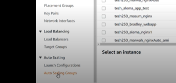
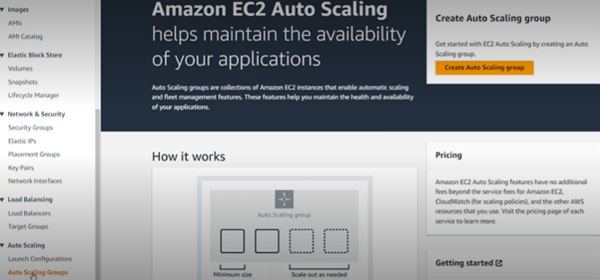
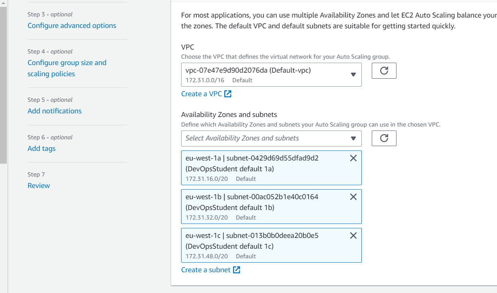
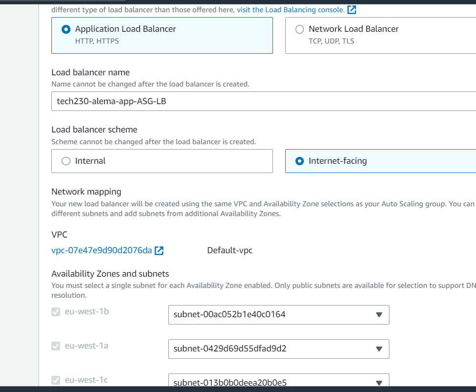
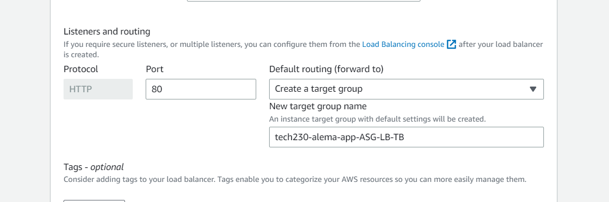
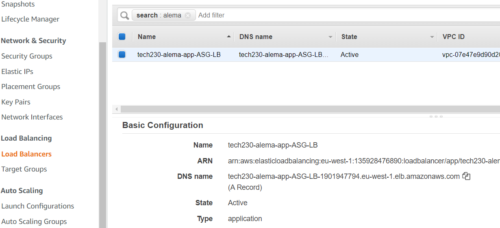

### Launch a new instance for nginx 

1. Launch a new instance like we have before and fill in the details: ubuntu 18.04, t2.micro, key:pair value tech230, and select existsing security group 
In the user data, add in commands for nginx:

```

#!/bin/bash

# Update and upgrade packages
sudo apt-get update -y
sudo apt-get upgrade -y

# Install nginx web server
sudo apt-get install nginx -y

# Restart nginx web server
sudo systemctl restart nginx

# Keep it running on reboot
sudo systemctl enable nginx

```

2. Open a new tab using the public IP address for the instance. The nginx welcome page may take some time to load as it has to make the EC2,update and upgrade.

3. Next, we need to create an AMI (to get a snapshot) and use to make a launch template. On the instance summary page, we can navigate to actions > image and template > create an image.

4. Give the image a name e.g., tech230_alema_nginx_ami1. You can also add  description e.g., 18.04 image running nginx.

5. Click 'create image'

6. Click on the AMI id to get to it's summary page. As you will see, your AMI is unnamed. To name it, click on the pen icon and give it the same name as your AMI (tech230_alema_nginx_ami1).

### Creating a launch template 

The launch template will be used by asg - need to add in run app command in background

1. On the side bar, navigate to launch template > create launch template.

2. Give your launch template a name e.g. tech230_alema_nginx_LT.

3. For the AMI section, click on 'my AMIs' and find the AMI you have just created (tech230_alema_nginx_ami1).

4. Fill out the rest as ususal: instance type (T2 micro), key pair (tech230), select your existing security group that allows http.

5. In advanced settings, you can add in the commands to run nginx in the user data section (but not needed).

6. Click 'create launch template'.

7. Make sure you delete the instance that was running previously


### Running the app on a new autoscalling group

1. Launch a new instance (following the steps above) for the app. In the user data, add in everything you need for the app to run:

```

#!/bin/bash

# Update and upgrade packages
sudo apt-get update -y
sudo apt-get upgrade -y

# Install nginx web server
sudo apt-get install nginx -y


# Reverse proxy

sudo sed -i 's+try_files $uri $uri/ =404;+proxy_pass http://localhost:3000/;+' /etc/nginx/sites-available/default

# Restart nginx web server
sudo systemctl restart nginx

# Keep it running on reboot
sudo systemctl enable nginx

# Install app dependencies
curl -sL https://deb.nodesource.com/setup_12.x | sudo -E bash -
sudo apt-get install nodejs -y
sudo npm install pm2 -g

# Add database host IP info to .bashrc
echo -e "\export DB_HOST=mongodb://172.31.59.25:27017/posts" | sudo tee -a .bashrc
source /home/ubuntu/.bashrc

# Get repo with app folder

git clone https://github.com/Asanjena/app.git /home/ubuntu/repo

# Install the app

cd /home/ubuntu/repo/app   
sudo npm install

# Seed the database
node seeds/seed.js

# Start the app
pm2 start app.js --update-env

# If already started, restart (idempotency)
pm2 restart app.js --update-env


```


2. Create an ami (for app launch template)

3. On ami summary page, name ami appropriately e.g. tech230-alema-app-ami2

4. On the side bar, navigate to launch template > create launch template. Follow the steps outlined above to create a launch template specifically for the app. Name the launch template appropriately e.g., tech230_alema_app_LT

**Note** - Select the AMI you have just created for the app. Again, you can add in the commands needed for the app in the user data section. 

5. Terminate previous instance


### Auto scaling groups for the app

1. On the side bar, click on 'Auto Scaling Groups' (located right at the bottom)




2. You should see a page like this come up:




Click 'create auto scale'. 


### Creating an auto scale group (ASG)

The next steps will go through the 7 steps for setting up auto scale:


1. First step is to choose 'lauch template or configuration': Here, give your ASG a suitable name and select the launch template relavant for the app. Then click next.

2. The second step is to choose your launch options. Here, we want to select the following availability zones for the app:





3. We then want to select 'attach a new load balancer' and 'application load balancer'. 

We also want to give the load balancer an approriate name e.g., tech230-alema-app-ASG-LB.


As you can see below, the 3 availability zones are already filled in:




You should also create a new target group and name it appropriately:




Finally, select the tick box for 'Turn on Elastic Load Balancing health checks'


4. Step 4 is 'Configure group size and scaling policies'. Here you can set the desired minimum and max capcities. For the app we did: desired 2, minimum 2, and max 3.


We also want to select 'Target tracking scaling policy'


5. For the next step, you can enable notifications if you would like to be notified each time an instance is made/ removed. For this demo, we will leave it as the default settings.


6. In the next step, we will add a tag. This is important so that the instances are taged and not nameless. For 'Key' we will say 'Name', and for 'Value' we can put 'tech230-alema-app-HA-SC'

**Note** the -HA-SC (high availability and scalability) part of this name will help to remeber that this is the one linked to the ASG.


7. Finally, you are presented with a review page. After reviewing, you can go ahead and create the ASG. 


8. Go to Load balancers (on the left hand side) and search for your load balancer. Scroll down and you should be able to see the DNS name. Copy this and paste it into a web browser. It may take some time for the app page to load as the two EC2 instances are spining up. 





Copy this and paste it into a web browser. If successful, you should then be able to see the sparta app page.


### DB user data

#!/bin/bash

sudo apt-get update -y
sudo apt-get upgrade -y

sudo apt-key adv --keyserver hkp://keyserver.ubuntu.com:80 --recv D68FA50FEA312927

echo "deb https://repo.mongodb.org/apt/ubuntu xenial/mongodb-org/3.2 multiverse" | sudo tee /etc/apt/sources.list.d/mongodb-org-3.2.list

sudo apt-get update -y
sudo apt-get upgrade -y


sudo apt-get install -y mongodb-org=3.2.20 mongodb-org-server=3.2.20 mongodb-org-shell=3.2.20 mongodb-org-mongos=3.2.20 mongodb-org-tools=3.2.20

sudo sed -i "s

sudo systemctl restart mongod
sudo systemctl enable mongod


