# tech_230_AWS

### Cloud Computing

Cloud computing delivers computing resources such as: storage, processing power, and software applications. It does this over the internet on a pay-as-you-go, on demand basis.

Users can therefore access computing resources and utilise them remotely instead of being limited locally on individual computers. 


**History of Cloud Computing**
- In 50-60s, the idea around many users being able to access a single mainframe computer at the same time emerged
- 70-80s - Advances in virtualisation with many VMs being able to run on 1 machine, creating a baseline for sharing resources and scalability
- 90-2000s - Saw more internet based services. Web host providers were able to offer storage and virtual servers over the web. Salesforce.com came in 1999, started the idea of providing enterprise applications through a web browser.
- Mid-2000s - AWS launched in 2006. This gives on demand computing resources, storage and infrastructure services that are scalable. Marked the start of modern cloud computing.
- 2008-2010 - Google App Engine allowed devs to make and deploy web applications in the cloud. Microsoft also made Azure in 2010 which provides a suite of cloud services.

Currently, many providers offer the followinf solutions:
- Infrastructure as a Service (IaaS)
- Platform as a Service (PaaS)
- Software as a Service (SaaS)


### Benefits of cloud computing

- Scale resources
- Reduce costs
- Increase flexibility
- Access many applications and services without needing major infrastrucure investments


###  Amazon Web Services (AWS)

AWS  is Amazon's cloud computing platform. It offers cloud services like: Computing power, storage, databases, analytics, networking, machne learning, and more. This allows for scalability and flexible cloud resources. 

2006 - AWS was launched to provide on demand acces to computing resources using the internet

Early stages - Initially focused on providing IaaS e.g., Elastic Compute Cloud (EC2) for virtual servers and Simple Storage Service (S3) for scalable storage.

Expansion stages - AWS added more services like databases (RDS, DynamoDB), networking (VPC), CloudFront, serverless computing (Lambda), AI services...

It started to attract attention in the market due to it's infrastructure being very robus, It also offered serveral services and a cost effective pay-as-you-go model

It has AWS regions. These refer to their global network of data centers found in different geographical locations. The AWS regions have availablility zones which provide extensions, helping to reduce latency and fault tolerance.  


### Who are the other main cloud providers
- Microsoft Azure
- Google Cloud Platform
- IBM Cloud
- Oracle Clod Infrastructure 
- Alibaba Cloud

### What is IaaS, PaaS and SaaS - make a diagram

**IaaS** - Infrastructure as a Service is a cloud computing model where the cloud service provider offers virtualized computing resources, such as virtual machines, storage, and networking, to users. Users have control over the operating systems, applications, and configurations running on the infrastructure.

**PaaS** - Platform as a Service is a cloud model where the cloud service provider offers a platform that includes the infrastructure and tools need to make, deploy, and manage applications. Users focus on developing and managing their applications, while the underlying infrastructure is abstracted away.

**SaaS** - Software as a Service is a model where the cloud service provider delivers software applications over the internet. Users access and use these applications through a web browser or API without the needing local installation or management. The provider handles the infrastructure, maintenance, and updates of the software.


### Differences between public, hybrid, and private clouds 

## Public Cloud

- cloud services that are available to the general public over the internet

- Resources are shared among multiple organizations or users

- offers scalability, cost-efficiency, and eliminates the need for on-premises infrastructure management


Examples: AWS, Microsoft Azure, Google Cloud Platform.

Start ups and small businesses, SaaS providers, and web and monile apps may use this cloud type.


## Private Cloud

- cloud infrastructure for only a single organisation.

- Resources are not shared with providing greater control, security, and privacy

- More customisation options but may need higher initial investment and maintenance costs.

Examples: On-premises data centers and privately hosted cloud environments.

Businesses with data privacy concerns, regulatory compliance requirements e.g. banking services, and large corporations who want full control, may use this cloud type.


## Hybrid Cloud 

- A combination of public and private cloud environments, allowing seamless integration and data sharing between them.

- Organisations can leverage both on-premises infrastructure and public cloud services to meet needs.

- provides flexibility, scalability. You can use public cloud resources for non-sensitive data, while keeping sensitive data in a private cloud.

- Gives a balance between control, security, and cost-efficiency. 

- Needs integration and management of both environments, and data transfer between them may involve security considerations.

Examples: Combining on-premises infrastructure with public cloud services for specific workloads or applications.

Businesses that have varied workloads/ seasonal demands, data-intensive applications, and want to expand their coloud infrastructure and be able to use multiple cloud providers to choose the more suitable services for different needs, may use this cloud type. 


### Operating Expenditure (OpEx)

This is the ongoing expenses that a business has for it's day-to-day operations.

It is the costs needed to keep businesses going and make revenue.

This is the best option for businesses due to it's pay-as-you-go aspect; If you no longer need something, you can turn it off and save the business costs. 

Examples of OpEx include:
- Employee salaries and benefits 
- Rent 
- Marketting and advertising 
- Equipment 


### Capital Expenditure (CapEx)

CapEx is the flat funds that a business invests in acquiring, upgrading, or maintaining long-term assets or capital assets. Capital expenditures are typically made with the intention of generating benefits and value over an extended period.

On premises, this will include any hardware/ infrastructure


###  How the clouds enable businesses to transfer to spending more on OpEx

1. **Elimination of Upfront Costs**: In the cloud, businesses can leverage infrastructure provided by cloud service providers, eliminating the need for large initial CapEx outlays.

2. **Scalability** and **Flexibility**: Cloud services allow businesses to scale their resources up or down based on demand. Instead of investing in overprovisioned infrastructure to accommodate peak loads, businesses can dynamically allocate and pay for the resources they need, aligning expenses with actual usage.

3. **Subscription-Based Pricing**: Cloud providers often offer subscription-based pricing models, where businesses pay for cloud services on a monthly or usage-based basis. This OpEx approach allows businesses to convert their infrastructure costs into ongoing operational expenses, simplifying budgeting and financial planning.

4. **Maintenance and Support**:  This relieves businesses from the burden of maintaining and upgrading their own infrastructure, reducing associated CapEx costs.

5. **Lower Total Cost of Ownership (TCO)**. Buisnesses They can avoid the costs of purchasing, maintaining, and replacing hardware and software, as well as expenses related to power, cooling, physical space, and IT personnel required for on-premises infrastructure.

6. **Resource Optimisation**: Cloud services enable businesses to optimize their resource utilization, scaling resources up during peak periods and down during low-demand periods. This flexibility helps minimize idle capacity and reduce wasted costs, maximizing the efficiency of IT investments.

7. **Access to Advanced Technologies**: By leveraging the cloud, businesses can access cutting-edge technologies such as artificial intelligence, machine learning, big data analytics, and IoT without the need for upfront CapEx investment


### Cases of companies that have transfered to the cloud

1) **Netflix** - can scale it's infrastructure to handle big increases in streaming demand e.g., during popular show releases. 

Netflix uses AWS and its cloud infrastructure allows Netflix to provide it's contents globally. 


### EC2 setup on AWS

## Launching an EC2 Instance

1. Make sure you login to your account

2. Check that you are in the right region using the drop down near your username. For this demonstartion, we will use Europe (Ireland)

3. From here, search for EC2 in the search bar.

**note** An EC2 instance is a VM

## Creating our first instance

1. Click the orange button that says 'launch instance' (add image)

2. In the page that loads, we will configure our EC2 instance. (add image)

3. Under **Name and tags**, use the format: group, name of person, and what the reason for the EC2 is, to form the name. For example: 'tech230_alema_nginx'

4. In **Application and OS Images** we will choose our operating systems: 
- select 'quick start' and choose 'Ubuntu'. **Note** The options available are all AMIs. 
- In the drop down bellow this, select Ubuntu Server 20.04 LTS (HVM), SSD Volume Type (Free tier eligible) (add image)
- Under **architecture**, select 64-bit (x86)

These are the settings for this EC2, but you can always adjust to needs.

5. Next, hoose your **instance type**. For this example, we selected t2_micro. (add image)

6. In the **Key pair** section, you will need to select a key pair name. The key pair is used to securely connect to the instance using SSH. In this example, we need 'tech230'. (add image)

7. For **Network settings**, we want to create a scurity group. This section will set rules for who can have access.
- Select **create security group**. 
- Cleck on the 'enter' button at the top right of this block
- give a name to your security group (sg) e.g. tech230_alema_fisrt_sg. You can also add a description in the next box

- Under **security group rule 1**, make sure that the entries look like this:

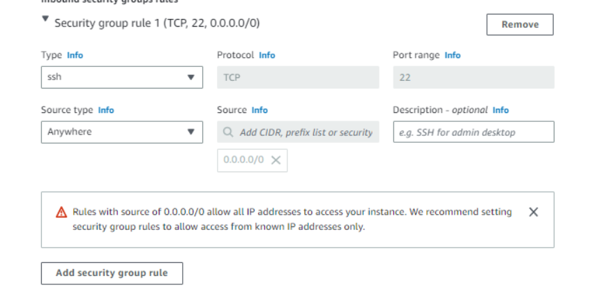


Anywhere (0.0.0.0) means that anyone with the key pair can access the instance.


8. You can use the **Configure Storage** section, however we will leave it as 8 GiB.

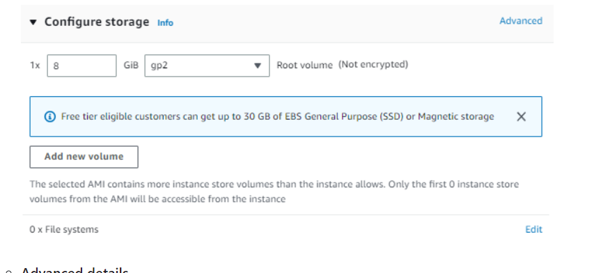

9. You can also complete the advanced details section, but we will leave this for now and go ahead and launch the EC2 instance.


### Connecting using SSH
 
To connect using SSH, use the key thatt your provider gave you (this should have been moved to your .ssh folder). In this case, it is 'tech230.pem

1. In a bash terminal, we will set the permisions to make the tech230 key 'read only' for everyone. In bash terminal, type:

``` 
chmod 400 tech230.pem
```

**note** - 400 gives read only rights (-r) to the file owner and no permissions for all others 

2. From AWS, copy the command underneath where it says **example** (add image)

3. Paste this command into bash. If asked for a prompt, enter 'yes' to veryify authenticity. It asks for this as you are adding the key to log in to the EC2 instance on the cloud for the first time.

If successful, you will be logged in to your EC2 instance.

### Getting Nginx server on AWS EC2

4. Enter the following into the terminal:

```
$ sudo apt update
$ sudo apt upgrade -y
$ sudo apt install nginx -y
$ sudo systemctl start nginx
$ sudo systemctl enable nginx
$ sudo systemctl status nginx

```

To access the address publicly from HTTP/S, we have to change the security group to add a new rule to allow HTTP/S.

Under your EC2 instance page, go to the 'Security' tab and add a new 'Inbound rule' for HTTP and another one for HTTPS using 0.0.0.0/0 range, as shown below

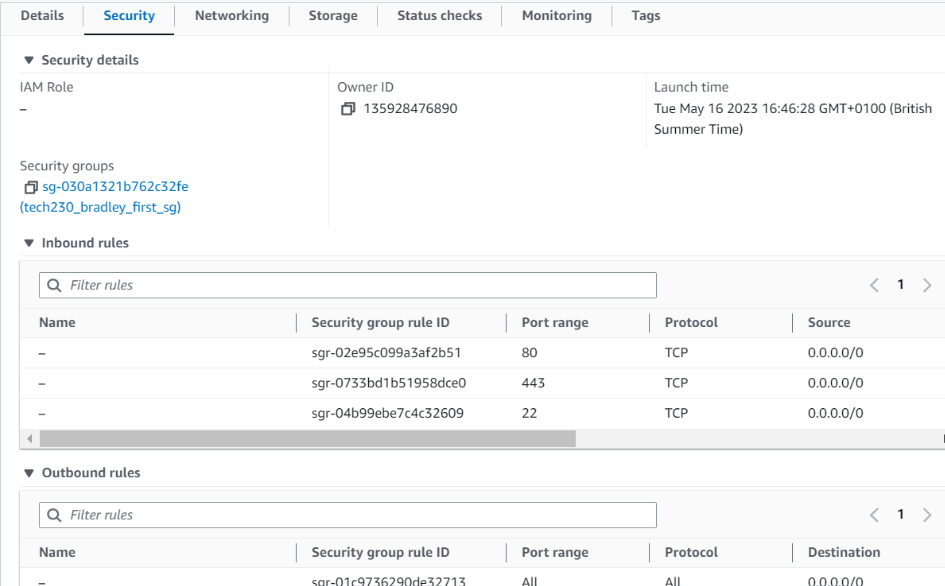


We should now be able to acces it using the public IPv4 address from the 'Instance summary' page. 

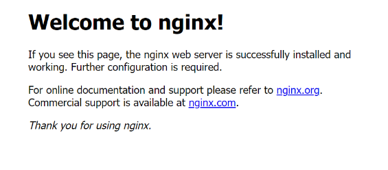


5. To terminate/ shut down the instance, select 'instance state' > 'terminate instance':

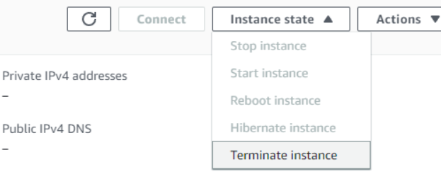


### Making a MongoDB AMI

First, we have to do this mannually before creating an AMI

1. Create an instance on aws (like we did with nginx)
2. Use the ssh output from the 'connect to instance page' and paste this into your bash terminal. In your bash terminal, you would input the following commands:

```
$ sudo apt update -y
$ sudo apt upgrade -y
$ sudo apt-key adv --keyserver hkp://keyserver.ubuntu.com:80 --recv D68FA50FEA312927
$ sudo apt install -y mongodb
$ sudo system start mongodb
sudo system enable mongod
```

**note** you can also add these commands into the 'user data' section when creating a EC2 instance:


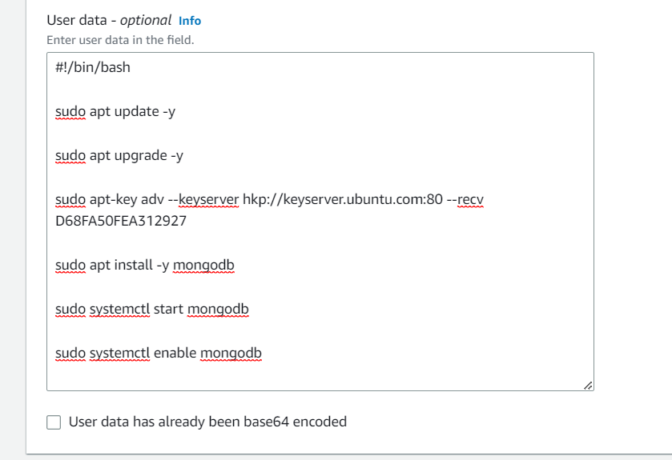


To check that it is working, you then type:

```
sudo systemctl status mongodb
```

If it worked, you should get an output saying that it is running.

3. After creating your instance, copy the ssh command and paste it into bash
4. Type 'sudo systemctl status mongodb' again, and it should show that it is running. 


## Creating the AMI/ launch templates

Now that we have created the instance and that MongoDB is running, creating an AMI will create a snapshot of this and can be used as a template to make multiple instances. 

1. in your instance summary for MongoDB, select instance state > image and templates > create an image from templates

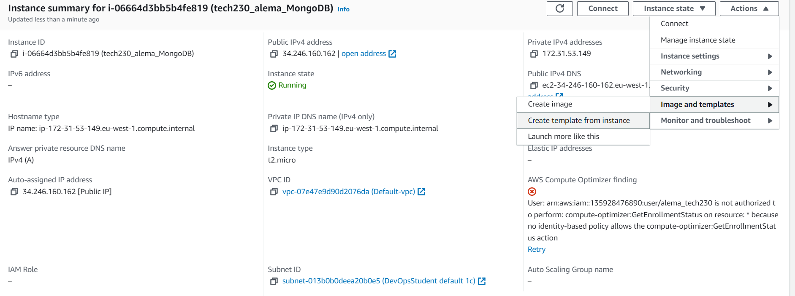

2. Add in your template name e.g. 'tech230_alema_mongodb_ami'

3. Make sure all the other settings are the same as what we did previously. **Note** for the network settings, you can choose 'select existing security group' and choose e.g. the nginx sg that we set earlier on to set the same rules. 

4. If you would like, you can add in your user data here under the **Advanced details** section (if you have not already done so earlier). 

5. Click 'create launch template'


6. To check that it is working, first terminate the EC2 instance. 

7. Then, got to your EC2 Dashboard > launch instance > launch instance from template 

8. choose your lauch template e.g. tech230_alema_mongodb_ami

9. If you did not add user data, you can do so now:

```
$ sudo apt update -y
$ sudo apt upgrade -y
$ sudo apt-key adv --keyserver hkp://keyserver.ubuntu.com:80 --recv D68FA50FEA312927
$ sudo apt install -y mongodb
$ sudo systemctl start mongodb
sudo systemctl enable mongod
```

10. Launch the instance 

11. Click on your instance id > connect > SSH client > copy the ssh command right at the bottom. (see image bellow) > paste into bash 

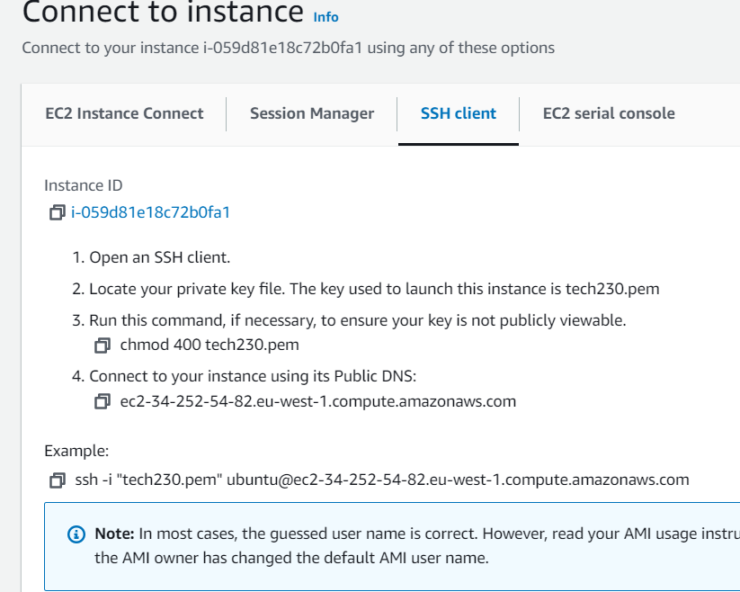


12. 'sudo systemctl status mongodb' again to see if it has worked

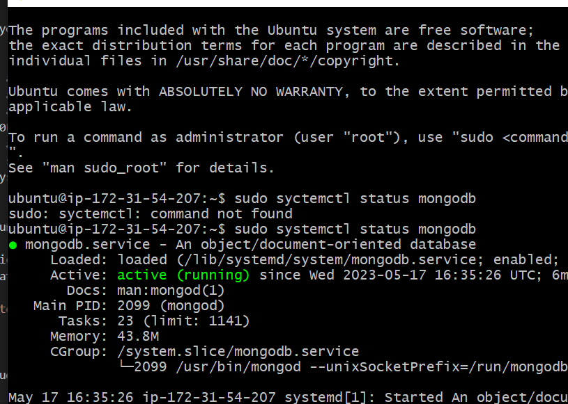


### Deploying Sparta App on EC2 

We need to copy our app folder onto the EC2

1. In bash, locate to where the app folder is (but do not cd into app! Just loacte the the folder that contains it)

2. On AWS, launch an nginx instance 

3. From the connect to instance page, copy the public DNS (this is 4. on the image bellow)


4. In bash, type:

```
scp -i "~/.ssh/tech230.pem" -r app

```
followed by the public DNS that you copied and **:/home/ubuntu** at the end e.g.,:

```
scp -i "~/.ssh/tech230.pem" -r app ubuntu@ec2-52-49-116-5.eu-west-1.compute.amazonaws.com:/home/ubuntu
```

**note** 'scp' stands for secure copy and is what we will use to copy the app folder.

**note** make sure you remember the ubuntu@ in frount of the public DNs that you paste into bash!

5. After entering this, it may take a while for the whole folder to be copied. Once finished, you can use 'ls' to check that the app folder appears.

6. On the same SSH client section, copy the ssh command and paste it into the terminal. At the end of the output, you should see something like this:

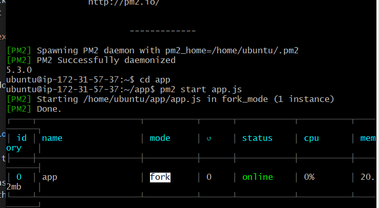

**you may need to add ~/.ssh/**

7. Now we use the following list of commands to install:

```
$ sudo apt update

$ sudo apt upgrade -y

$ curl -sL https://deb.nodesource.com/setup_12.x | sudo -E bash -

$ sudo apt install nodejs -y

$ sudo npm install pm2 -g

```

8. 'cd' into app

9. type 'npm install' or 'sudo apt install npm'

10. type 'node app.js' or 'pm2 start app.js' (to run it in the background)


## Running app and sg

To be able to view the sparta app page, we now need to add a new rule to sg on EC2 to allow traffic through the port. 

1. Go to your EC2 instance page, scroll down, and select 'security'. Edit this to add a new inboud rule:
- The 'type' should be 'custom TCP'
- The port should be 3000
- 0.0.0.0 (for source)

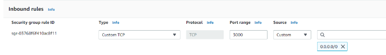

10. Now if you copy the instance IP, paste it into a web browser, and add :3000, you should see the sparta app. 


### Linking the two EC2 instances 

We will link both our nginx instances to see the sparta posts page 

1. Once you have both running instances running, run the following commands in your mongo bash terminal:

```
 $ cd /etc
 $ sudo nano mongodb.conf
 ```

 2. In the nano terminal that pops up, change the bind ip to 0.0.0.0

 
 3. We then need to restart and enable mongodb:

 ```
 $ sudo systemctl restart mongodb
 & sudo systemctl enable mongodb
 ```

 4. Go back to your EC2 instance for mongodb and add a rule to sg so that you have custom TCP '27017' and '0.0.0.0' (for source) (add image)

 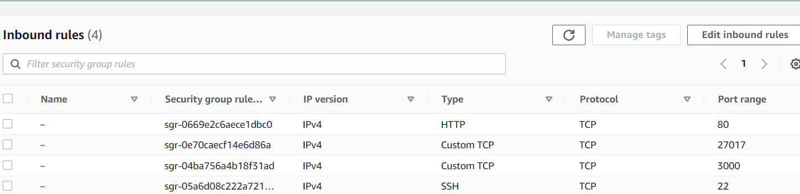


 In app bash terminal

 1. 'ls' check that app is there

 2. node -- version to check for version 12 

 3. Type:

 ```
 export DB_HOST=mongodb://(add private id from mongo ec2 instance summary page)/posts

 e.g., export DB_HOST=mongodb://172.31.63.89/posts

 ```

 4. printenv

 5. cd app

 6. npm install (sometimes, you may have to do node seed/seed.js)

7. pm2 start app .js --update-env

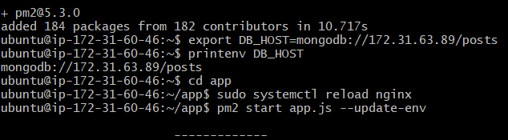


To check that posts page works, copy and paste the public IPv4 adress from your nginx EC2, paste it into browser with/ posts at the end 

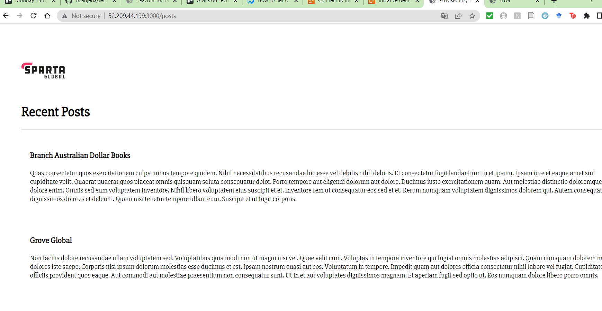


### Creating Images for both these EC2 instances

1. select your running instance > actions > images and templates > create an image

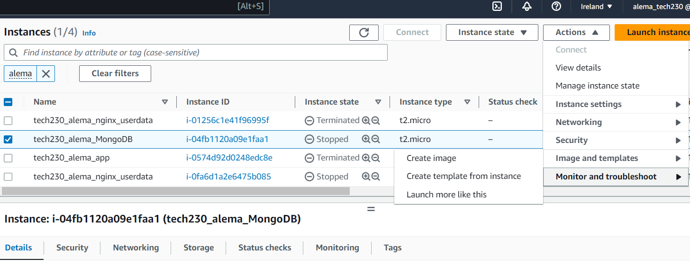

2. Then add a name and a description for your image. You can also add tags if you would like.

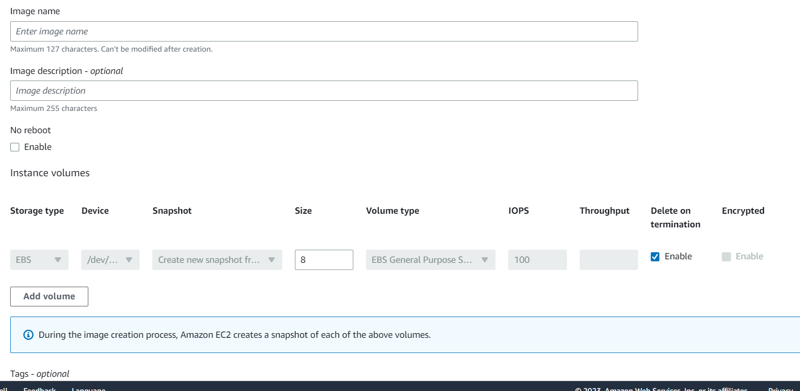

3. Once you hav edone this, click the create button

Follow these steps for both the MongoDB and Nginx EC2 instances 


Task 1a

### Adding a reverse proxy script

1. Create a script file in your app bash terminal:

```
touch app-provision.sh
```

2. To edit the file and add to our scipt, we will use:

```
nano app-provision.sh

```

3. In the script, we wnat the following:

```

sudo bash -c 'cat <<EOF > /etc/nginx/sites-available/default
server {

    listen 80 default_server;

    listen [::]:80 default_server;

    root /var/www/html;

    server_name 18.202.19.236


    location / {

        proxy_pass http://18.202.19.236:3000;

        proxy_http_version 1.1;

        proxy_set_header Upgrade \$http_upgrade;

        proxy_set_header Connection 'upgrade';

        proxy_set_header Host \$host;

        proxy_cache_bypass \$http_upgrade;

 }

    location /posts {

        proxy_pass http://18.202.19.236:3000;

        proxy_http_version 1.1;

        proxy_set_header Upgrade \$http_upgrade;

        proxy_set_header Connection 'upgrade';

        proxy_set_header Host \$host;

        proxy_cache_bypass \$http_upgrade;
    }

}

EOF'

```

You have to change your server name and both proxy pass scriots to have your app EC2 public IPs
4. Save and exit the nano terminal.

5. To add execution permission, type:

```
chmod +x app-provision.sh
```

6. use 'ls' to check that file is green and therefore has the right permission

7. To run the file, 

```
sudo bash ./app-provision.sh
```

8. 


