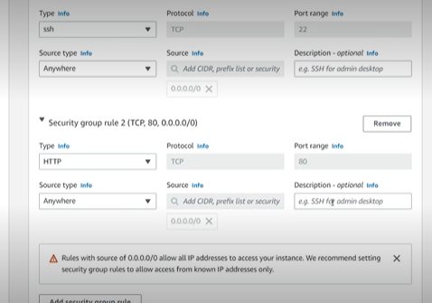
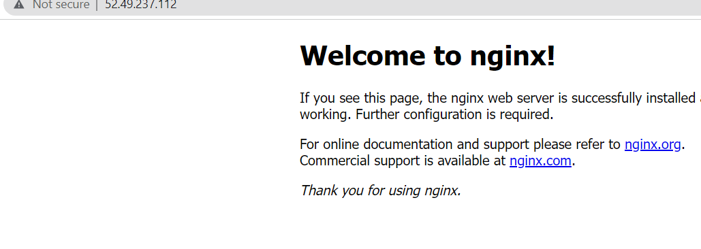

### VPCs

Virtal Private Clouds (VPC) are private clouds hosted within a public cloud. They are offered by cloud service providers such as AWS and Azure. With a vpc, you can generate and manage a isolated network environment 

(add diagram)


When you create an account on AWS, it will set up a default vpc in every region. 


Features of a vpc:

- Subnets. These are like the 'rooms' for a vpc. They can 'talk' to each other through something called a route table and are liked to availability zones. 


The we will go through the following steps for setting up everything we need for a nginx vpc: 1. Setting up a VPC 2. Setting an Internet Gateway 3. Connecting the internet gateway to the VPC 4. Creating subnets - for this demo, a private subnet 5. Creating a public route table 6. Linking route table to the Internet Gateway 7. Creating virtual machine (in this demo, one for just nginx).

### Setting up a VPC

In the AWS search bar, type 'vpc':

1. Click 'create vpc'
2. Select 'vpc only'
3. In the **tag** section, type a suitable name e.g., tech230-alema-nginx-vpc
4. Set the IPv4 CIDR to:

```
10.0.0.0/16
```
5. Click 'create vpc'


### Setting an Internet Gateway

Afte setting up a vpc, you should see an option called 'Internet gateway' on the left sidebar.

1. Go to Internet gateway on the sidebar.
2. Click 'create internet gateway'
3. type an appropriate name e.g., tech230-alema-nginx-vpc-IGW
4. click 'create internet gateway'


### Connect internet gateway to vpc

Afte setting the internet gateway, you should see a green bar at the top of the screen with the option to click on 'attach to vpc'

1. Click on 'attach to vpc'
2. Under **available vpc**, search for your name/ vpc, click on the one that appears and attach to internet gateway


### Creating public subnet

1. On the sidebar menu, click on 'create subnet'
2. Select your vpc again (tech230-alema-nginx-vpc)
3. Give your subnet a name e.g., tech230-alema-nginx-public-subnet
4. Select avaialbility zone for your subnet. For this nginx demo, we will select 1a. When we create two subnets later (one public for the app and one private for the data base), we will select 1a for the public subnet again and 1b for the private subnet. This just means if anything was to happen to one, at least the other will not be affected.
5. Set IPv4 CIDR to:

```
10.0.2.0/24
```

### Creating a public route table

1. Click on 'route table' on the sidebar menu
2. Create a route table
3. Give the RT a name e.g., tech230-alema-public-RT
4. Select vpc (tech230-alema-nginx-vpc)
5. Click 'create RT'

### Linking route table to the public subnet

1. Scroll down to subnet associations after clicking 'create route table'. We will need to let the RT know that the subnet should be linked 
2. Click 'edit subnets' > check the tick box for the public subnet. 

**note** At this stage, you should only add public subnets
3. Save associations

Now if you check under explicit subnet associations, you should see your subnet here. 


### Linking route table to internet gateway 

1. Next to the subnet association tab, click 'routes'
2. Click on 'edit routes' and then 'add route'
3. In destination, you want:

```
0.0.0.0
```

4. Go to target > internet gateway > and select the option that comes up
5. Click save changes 


### Create virtual machine 

For this demo, we will just create one for nginx

1. Like we have done before, we will launch a instance
2. Follow previous steps such as adding a name e.g. tech230-alema-nginx-in-vpc, find ubuntu 18.04, select tech230 for key pair
3. Click on the edit button for network settings > make sure that auto assign public IP is **enabled**
4. For existsing security groups, we must create a new one. This showuld include 3000, SSH (22), and http(80).



5. We will then add the nginx commands in user data:

```
Update and upgrade packages
sudo apt-get update -y
sudo apt-get upgrade -y

# Install nginx web server
sudo apt-get install nginx -y

```

6. Finally, we will click on 'launch'. The on the instance details page, copy the public IPv4 into a web browser using http. You should see the nginx welcome page load after some time. 



