### VPCs

Virtal Private Clouds (VPC) are private clouds hosted within a public cloud. They are offered by cloud service providers such as AWS and Azure. With a vpc, you can generate and manage a isolated network environment 

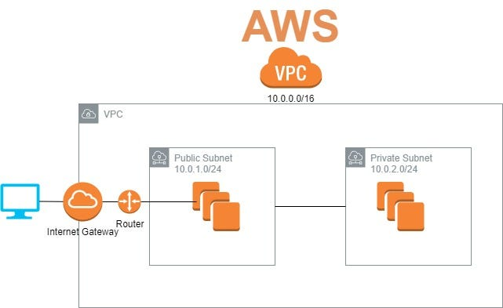


When you create an account on AWS, it will set up a default vpc in every region. 


Features of a vpc:

- Subnets. These are like the 'rooms' for a vpc. They can 'talk' to each other through something called a route table and are liked to availability zones. 
- Route tables
-Internet Gateways
-Virtual machines.


We will go through the following steps for setting up everything we need for a nginx vpc: 1. Setting up a VPC 2. Setting an Internet Gateway 3. Connecting the internet gateway to the VPC 4. Creating subnets - for this demo, a private subnet 5. Creating a public route table 6. Linking route table to the Internet Gateway 7. Creating virtual machine (in this demo, one for just nginx).

## 1) Setting up a VPC

In the AWS search bar, type 'vpc':

1. Click 'create vpc'
2. Select 'vpc only'
3. In the **tag** section, type a suitable name e.g., tech230-alema-nginx-vpc
4. Set the IPv4 CIDR to:

```
10.0.0.0/16
```
5. Click 'create vpc'

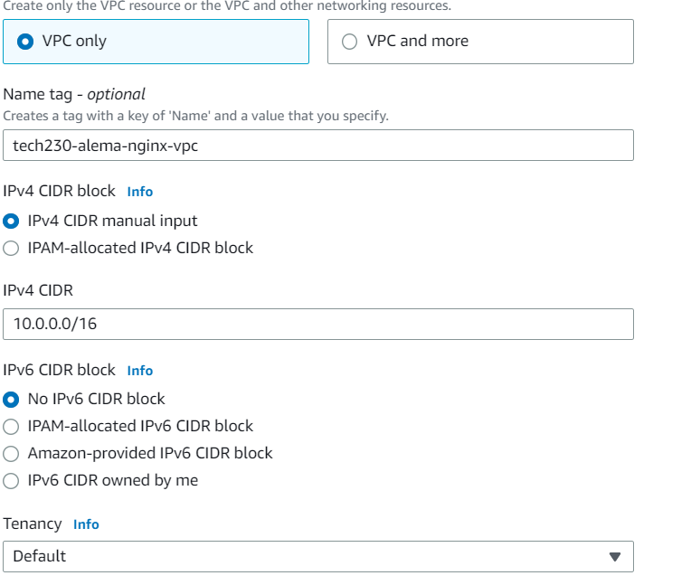


## 2) Setting an Internet Gateway

Afte setting up a vpc, you should see an option called 'Internet gateway' on the left sidebar.

1. Go to Internet gateway on the sidebar.
2. Click 'create internet gateway'
3. type an appropriate name e.g., tech230-alema-nginx-vpc-IGW
4. click 'create internet gateway'

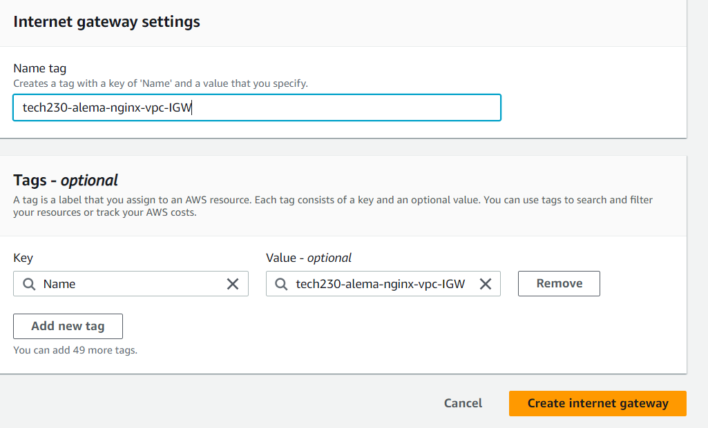


## 3) Connect internet gateway to vpc

After setting the internet gateway, you should see a green bar at the top of the screen with the option to click on 'attach to vpc'

1. Click on 'attach to vpc'
2. Under **available vpc**, search for your name/ vpc, click on the one that appears and attach to internet gateway


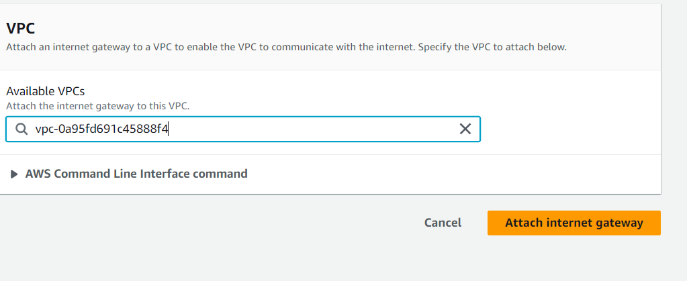

## 4) Creating public subnet

1. On the sidebar menu, click on 'create subnet'
2. Select your vpc again (tech230-alema-nginx-vpc)
3. Give your subnet a name e.g., tech230-alema-nginx-public-subnet
4. Select avaialbility zone for your subnet. For this nginx demo, we will select 1a. When we create two subnets later (one public for the app and one private for the data base), we will select 1a for the public subnet again and 1b for the private subnet. This just means if anything was to happen to one, at least the other will not be affected.
5. Set IPv4 CIDR to:

```
10.0.2.0/24
```

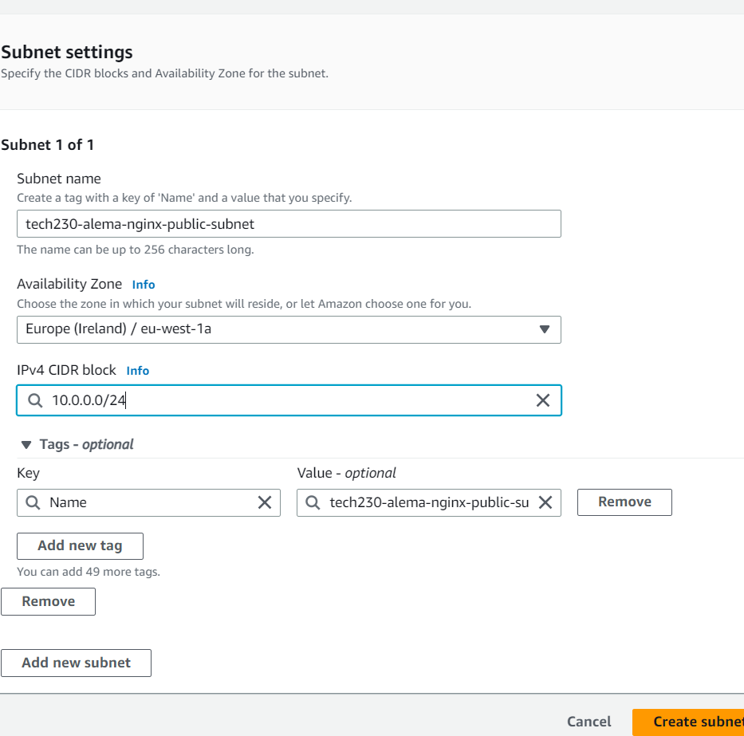

## 5) Creating a public route table

1. Click on 'route table' on the sidebar menu
2. Create a route table
3. Give the RT a name e.g., tech230-alema-public-RT
4. Select vpc (tech230-alema-nginx-vpc)
5. Click 'create RT'

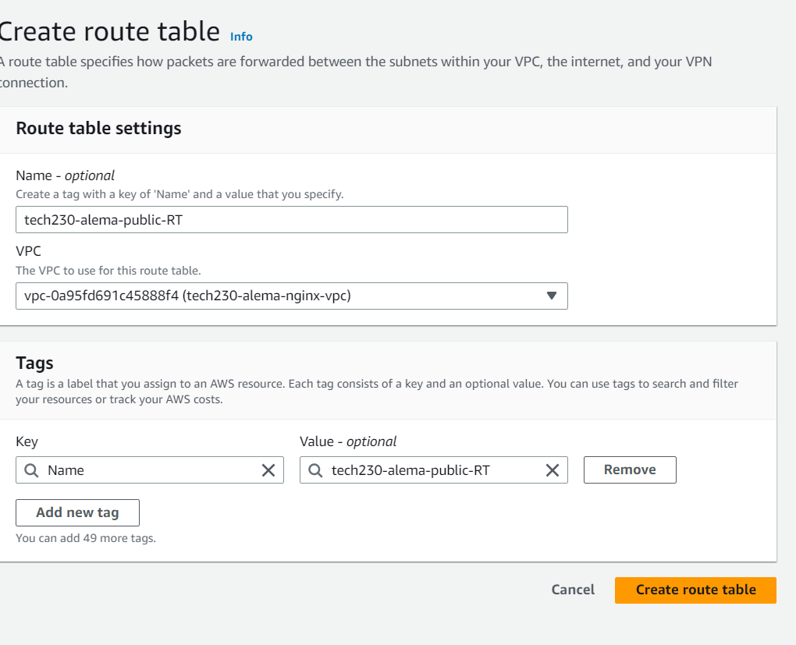


## 6) Linking route table to the public subnet

1. Scroll down to subnet associations after clicking 'create route table'. We will need to let the RT know that the subnet should be linked 
2. Click 'edit subnets' > check the tick box for the public subnet. 

**note** At this stage, you should only add public subnets
3. Save associations

Now if you check under explicit subnet associations, you should see your subnet here. 


## 7) Linking route table to internet gateway 

1. Once your RT has been created, on the summary page click actions > edit routes
2. Click on 'add route'
3. In destination, you want:

```
0.0.0.0
```

4. Go to target > internet gateway > and select the option that comes up
5. Click save changes 


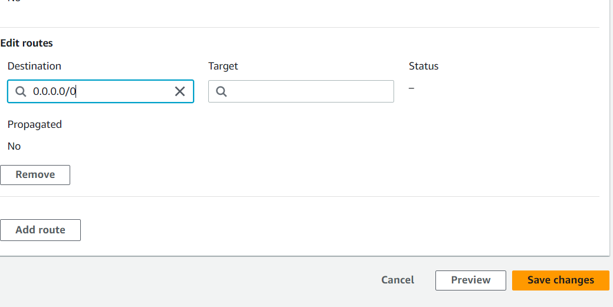

## 8) Create virtual machine 

For this demo, we will just create one for nginx

1. Like we have done before, we will launch an instance
2. Follow previous steps such as adding a name e.g. tech230-alema-nginx-in-vpc, find ubuntu 18.04, select tech230 for key pair
3. Click on the edit button for network settings > make sure that auto assign public IP is **enabled**
4. For existsing security groups, we must create a new one. This showuld include 3000, SSH (22), and http(80).

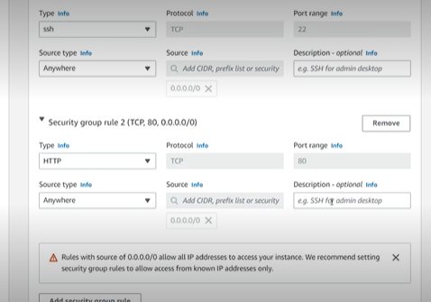

5. We will then add the nginx commands in user data:

```
Update and upgrade packages
sudo apt-get update -y
sudo apt-get upgrade -y

# Install nginx web server
sudo apt-get install nginx -y

```

6. Finally, we will click on 'launch'. Then on the instance details page, copy the public IPv4 into a web browser using http. You should see the nginx welcome page load after some time. 

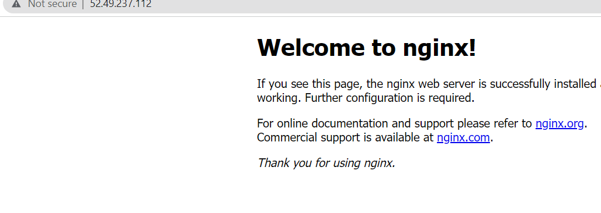


## 2 Tier architecture 

To create a 2 tier architecture, we will follow the steps above but with some slight changes:

### 1) Create your vpc

1. Follow the same steps above, but this time change the name so that you know it is for your 2 tier vpc.

### 2) Setting an Internet Gateway

1. Again, make sure that you set a suitable name and follow the steps above


### 3) Subnets

1. For your public subnet give it a suitable name (identify that it is the public subnet) and:

- set CIDR to 10.0.2.0/24
- set availability zone to 1a

2. Add a new private subnet (for db). Call it tech230-alema-2tier-private-subnet

- set availability zone to 1b 
- CIDR block to 10.0.3.0/24

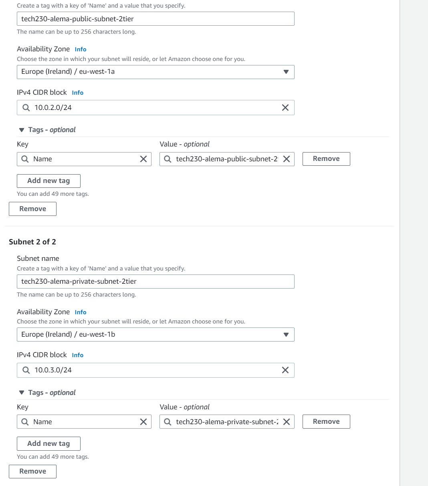

Click create

### 4) Create you public route table

1. Give it a name
2. Select your vpc 

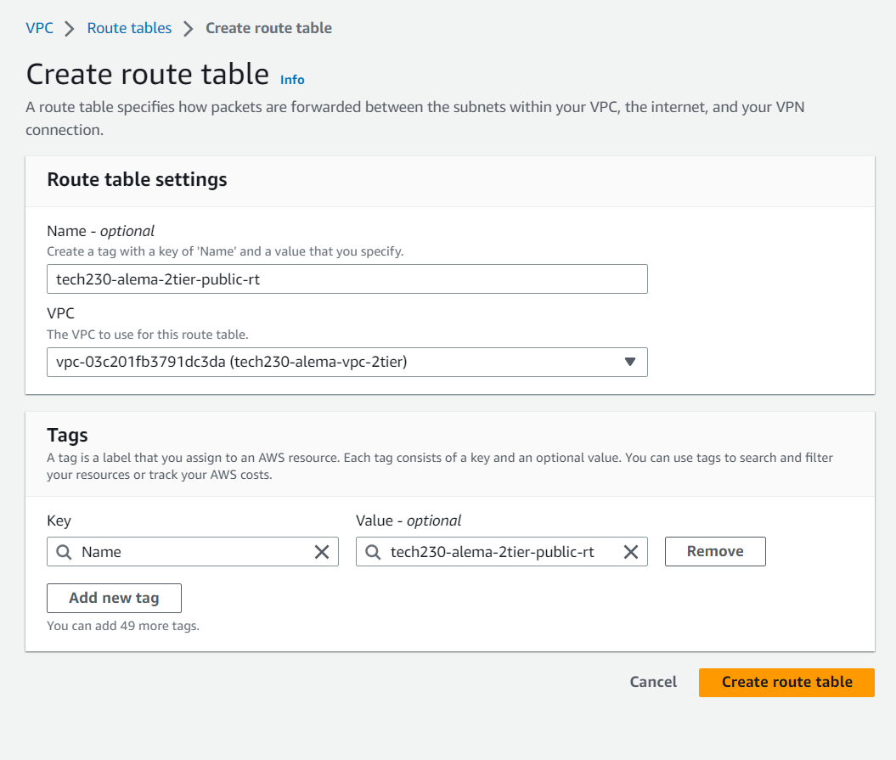

you do not have to create a private one. 

### 5) Associating your subnet

We want to associate our public subnet to the public route table

1. To do this, we can follow the previous step '6) Linking route table to the public subnet' 


### 6) Linking route table to internet gateway 

1. Next to the subnet association tab, click 'routes'
2. Click on 'edit routes' and then 'add route'
3. In destination, you want: 0.0.0.0/0

### 7) Creating db vm

1. DB Vm - name it tech230-alema-2tiervpc-db
2. Follow our normal steps: ubuntu 18.04, and key pair (tech230)
3. Click edit settings and then select your vpc:

4. For your db, you want to select your private subnet

5. For auto assign public IP - you want it to say 'Disable' so that outsiders cannot make their way in to it. 

6. We need to create new security groups:

For our db, we only really need to allow port 27017:

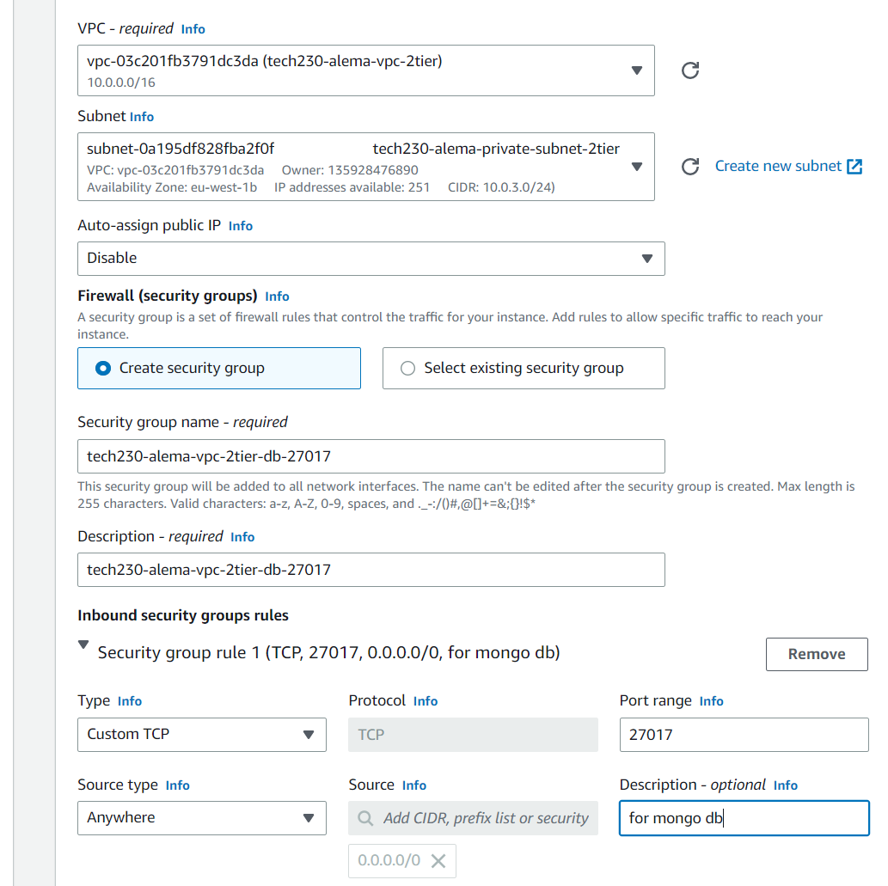

7. Then add in your user data:

```
#!/bin/bash

# Provisioning for db vm
# Update the sources list
sudo apt-get update -y

# upgrade any packages available
sudo apt-get upgrade -y

# Add the Key:
sudo apt-key adv --keyserver hkp://keyserver.ubuntu.com:80 --recv D68FA50FEA312927  

# Make Sure its Working
echo "deb https://repo.mongodb.org/apt/ubuntu xenial/mongodb-org/3.2 multiverse" | sudo tee /etc/apt/sources.list.d/mongodb-org-3.2.list

# It will display back - deb https://repo.mongodb.org/apt/ubuntu xenial/mongodb-org/3.2 multiverse

# Install database - sudo apt-get install mongodb-org=3.2.20 -y
# IMPORTANT: this line will fail if using Ubuntu 20.04 instead of 18.04
sudo apt-get install -y mongodb-org=3.2.20 mongodb-org-server=3.2.20 mongodb-org-shell=3.2.20 mongodb-org-mongos=3.2.20 mongodb-org-tools=3.2.20

# Change bindIp from 127.0.0.1 to specific IP of app (e.g. 192.168.10.150)
# (we could use 0.0.0.0 but this allow any IPs to connect to it)
sudo apt install sed
sudo sed -i "s/bindIp: 127.0.0.1/bindIp: 0.0.0.0/" /etc/mongod.conf

# Start mongodb and enable it
sudo systemctl start mongod

sudo systemctl enable mongod

#echo "Show whether mongo db is running..."
#sudo systemctl status mongod

```
Then launch instance.


### Create app vm

1. Follow all the steps for creating our db vm expect for these changes:

2. For the app vm, make sure you select your public subnet

3. For auto assign public IP - you want it to say 'enable'

4. When creating a new sg, we need to allow ssh and http. **note** - as our reverse proxy should work, we do not really need to add port 3000

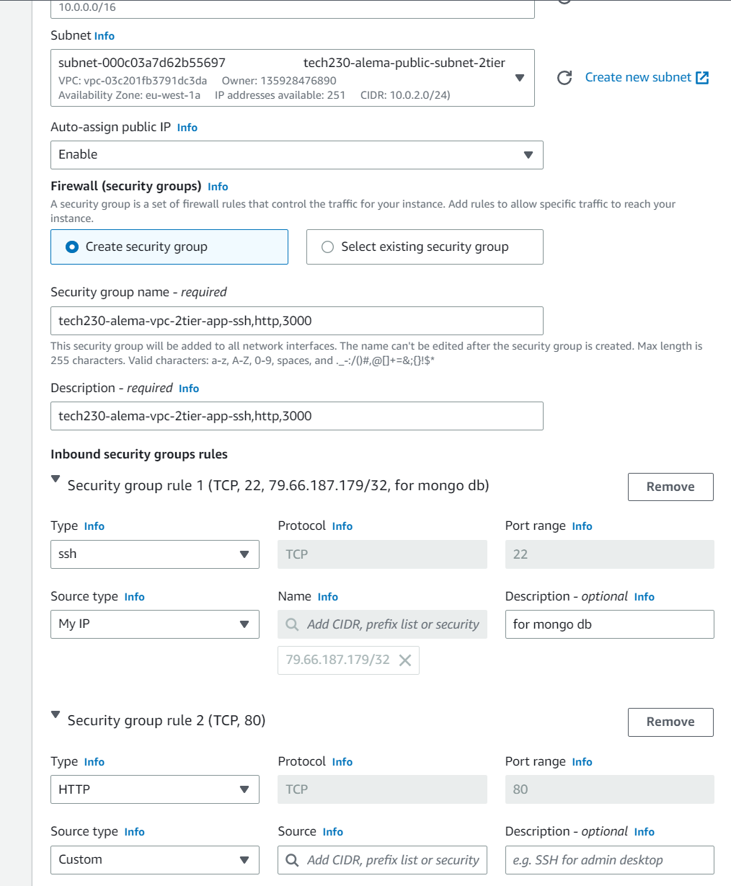

5. In user data:

```
#!/bin/bash

# Update the sources list
sudo apt-get update -y

# upgrade any packages available
sudo apt-get upgrade -y

# install nginx
sudo apt-get install nginx -y

# setup nginx reverse proxy
sudo apt install sed
# $ and / characters must be escaped by putting a backslash before them
sudo sed -i "s/try_files \$uri \$uri\/ =404;/proxy_pass http:\/\/localhost:3000\/;/" /etc/nginx/sites-available/default
# restart nginx to get reverse proxy working
sudo systemctl restart nginx

# install git
sudo apt-get install git -y

# install nodejs
# next line used to be: sudo apt-get install python-software-properties
sudo apt-get install python-software-common
curl -sL https://deb.nodesource.com/setup_12.x | sudo -E bash -
sudo apt-get install nodejs -y


# create global env variable (so app vm can connect to db)
#echo "Setting environment variable DB_HOST..."


export DB_HOST=mongodb://**add db vm private IPv4**:27017/posts

# clone repo with app folder into folder called 'repo'
git clone https://github.com/daraymonsta/CloudComputingWithAWS repo

# install the app (must be after db vm is finished provisioning)
cd repo/app
npm install

# seed database
echo "Clearing and seeding database..."
node seeds/seed.js
echo "  --> Done!"

# start the app (could also use 'npm start')

# using pm2
# install pm2
sudo npm install pm2 -g
# kill previous app background processes
pm2 kill
# start the app in the background with pm2
pm2 start app.js --update-env

```

**note** where is says **add db vm private IPv4** in the script, make sure you go to your db EC2 summary page, copy the public IPv4, and paste it here. 

6. You can then create the instance

7. Copy your app's public IPv4 into your web browser (making sure that you are using http://). After some time, you should see that the app pages work. 

