### EC2 setup on AWS

## Launching an EC2 Instance

1. Make sure you login to your account

2. Check that you are in the right region using the drop down near your username. For this demonstartion, we will use Europe (Ireland)

3. From here, search for EC2 in the search bar.

**note** An EC2 instance is a VM

## Creating our first instance

1. Click the orange button that says 'launch instance' (add image)

2. In the page that loads, we will configure our EC2 instance. (add image)

3. Under **Name and tags**, use the format: group, name of person, and what the reason for the EC2 is, to form the name. For example: 'tech230_alema_nginx'

4. In **Application and OS Images** we will choose our operating systems: 
- select 'quick start' and choose 'Ubuntu'. **Note** The options available are all AMIs. 
- In the drop down bellow this, select Ubuntu Server 20.04 LTS (HVM), SSD Volume Type (Free tier eligible) (add image)
- Under **architecture**, select 64-bit (x86)

These are the settings for this EC2, but you can always adjust to needs.

5. Next, hoose your **instance type**. For this example, we selected t2_micro. (add image)

6. In the **Key pair** section, you will need to select a key pair name. The key pair is used to securely connect to the instance using SSH. In this example, we need 'tech230'. (add image)

7. For **Network settings**, we want to create a scurity group. This section will set rules for who can have access.
- Select **create security group**. 
- Cleck on the 'enter' button at the top right of this block
- give a name to your security group (sg) e.g. tech230_alema_fisrt_sg. You can also add a description in the next box

- Under **security group rule 1**, make sure that the entries look like this:


Anywhere (0.0.0.0) means that anyone with the key pair can access the instance.


8. You can use the **Configure Storage** section, however we will leave it as 8 GiB.

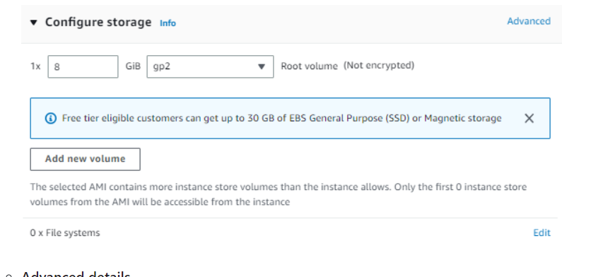

9. You can also complete the advanced details section, but we will leave this for now and go ahead and launch the EC2 instance.


### Connecting using SSH
 
To connect using SSH, use the key thatt your provider gave you (this should have been moved to your .ssh folder). In this case, it is 'tech230.pem

1. In a bash terminal, we will set the permisions to make the tech230 key 'read only' for everyone. In bash terminal, type:

``` 
chmod 400 tech230.pem
```

**note** - 400 gives read only rights (-r) to the file owner and no permissions for all others 

2. From AWS, copy the command underneath where it says **example** (add image)

3. Paste this command into bash. If asked for a prompt, enter 'yes' to veryify authenticity. It asks for this as you are adding the key to log in to the EC2 instance on the cloud for the first time.

If successful, you will be logged in to your EC2 instance.

### Getting Nginx server on AWS EC2

4. Enter the following into the terminal:

```
$ sudo apt update
$ sudo apt upgrade -y
$ sudo apt install nginx -y
$ sudo systemctl start nginx
$ sudo systemctl enable nginx
$ sudo systemctl status nginx

```

To access the address publicly from HTTP/S, we have to change the security group to add a new rule to allow HTTP/S.

Under your EC2 instance page, go to the 'Security' tab and add a new 'Inbound rule' for HTTP and another one for HTTPS using 0.0.0.0/0 range, as shown below

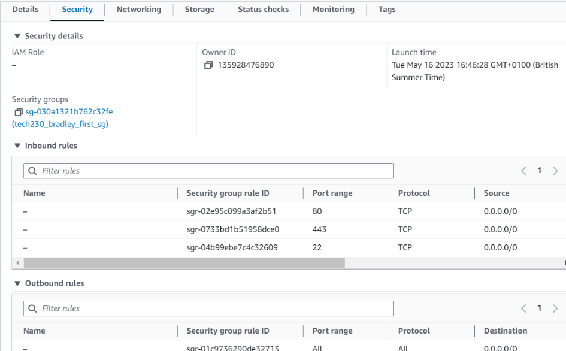


We should now be able to acces it using the public IPv4 address from the 'Instance summary' page. 

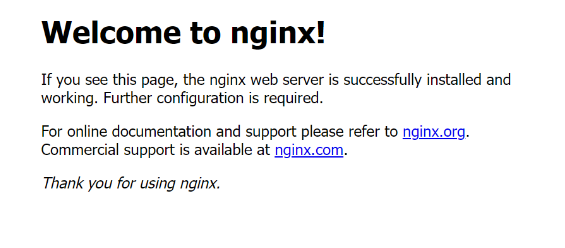


5. To terminate/ shut down the instance, select 'instance state' > 'terminate instance':

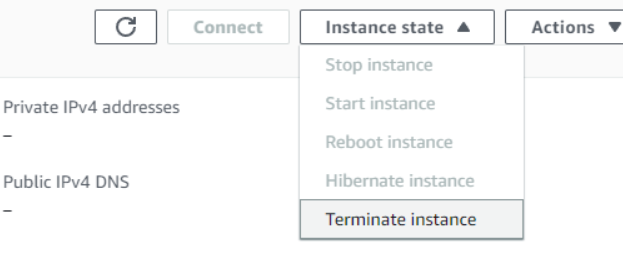


### Making a MongoDB AMI

First, we have to do this mannually before creating an AMI

1. Create an instance on aws (like we did with nginx)
2. Use the ssh output from the 'connect to instance page' and paste this into your bash terminal. In your bash terminal, you would input the following commands:

```
$ sudo apt update -y
$ sudo apt upgrade -y
$ sudo apt-key adv --keyserver hkp://keyserver.ubuntu.com:80 --recv D68FA50FEA312927
$ sudo apt install -y mongodb
$ sudo system start mongodb
sudo system enable mongod
```

**note** you can also add these commands into the 'user data' section when creating a EC2 instance:


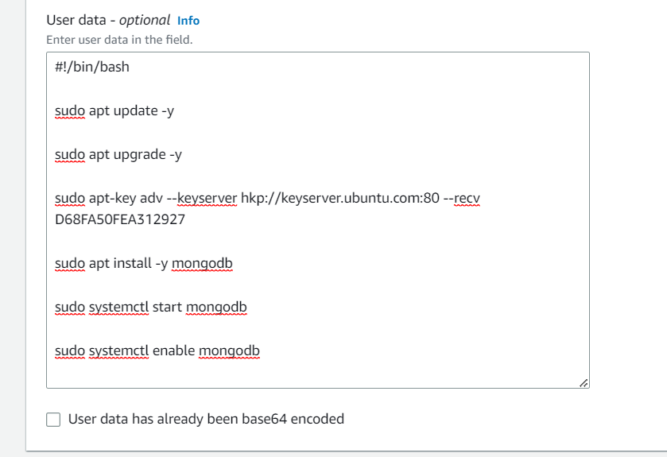


To check that it is working, you then type:

```
sudo systemctl status mongodb
```

If it worked, you should get an output saying that it is running.

3. After creating your instance, copy the ssh command and paste it into bash
4. Type 'sudo systemctl status mongodb' again, and it should show that it is running. 


## Creating the AMI/ launch templates

Now that we have created the instance and that MongoDB is running, creating an AMI will create a snapshot of this and can be used as a template to make multiple instances. 

1. in your instance summary for MongoDB, select instance state > image and templates > create an image from templates

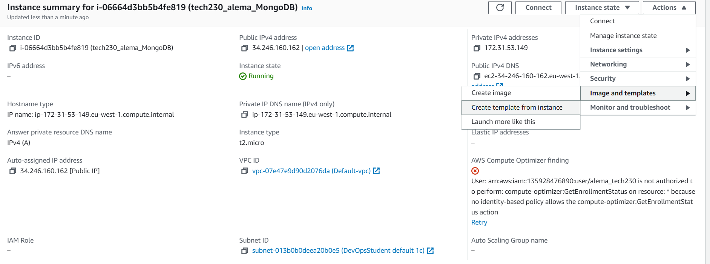

2. Add in your template name e.g. 'tech230_alema_mongodb_ami'

3. Make sure all the other settings are the same as what we did previously. **Note** for the network settings, you can choose 'select existing security group' and choose e.g. the nginx sg that we set earlier on to set the same rules. 

4. If you would like, you can add in your user data here under the **Advanced details** section (if you have not already done so earlier). 

5. Click 'create launch template'


6. To check that it is working, first terminate the EC2 instance. 

7. Then, got to your EC2 Dashboard > launch instance > launch instance from template 

8. choose your lauch template e.g. tech230_alema_mongodb_ami

9. If you did not add user data, you can do so now:

```
$ sudo apt update -y
$ sudo apt upgrade -y
$ sudo apt-key adv --keyserver hkp://keyserver.ubuntu.com:80 --recv D68FA50FEA312927
$ sudo apt install -y mongodb
$ sudo systemctl start mongodb
sudo systemctl enable mongod
```

10. Launch the instance 

11. Click on your instance id > connect > SSH client > copy the ssh command right at the bottom. (see image bellow) > paste into bash 

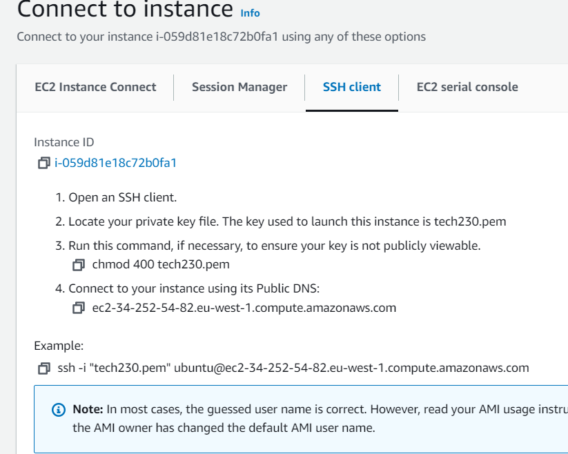


12. 'sudo systemctl status mongodb' again to see if it has worked

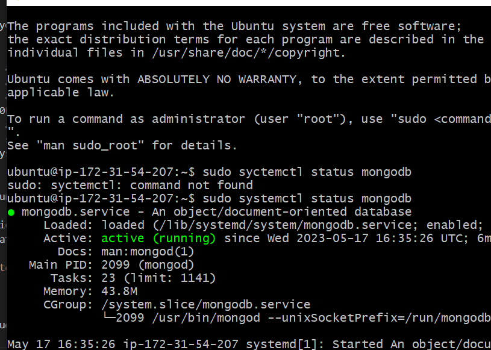


### Deploying Sparta App on EC2 

We need to copy our app folder onto the EC2

1. In bash, locate to where the app folder is (but do not cd into app! Just loacte the the folder that contains it)

2. On AWS, launch an nginx instance 

3. From the connect to instance page, copy the public DNS (this is 4. on the image bellow)


4. In bash, type:

```
scp -i "~/.ssh/tech230.pem" -r app

```
followed by the public DNS that you copied and **:/home/ubuntu** at the end e.g.,:

```
scp -i "~/.ssh/tech230.pem" -r app ubuntu@ec2-52-49-116-5.eu-west-1.compute.amazonaws.com:/home/ubuntu
```

**note** 'scp' stands for secure copy and is what we will use to copy the app folder.

**note** make sure you remember the ubuntu@ in frount of the public DNs that you paste into bash!

5. After entering this, it may take a while for the whole folder to be copied. Once finished, you can use 'ls' to check that the app folder appears.

6. On the same SSH client section, copy the ssh command and paste it into the terminal. At the end of the output, you should see something like this:

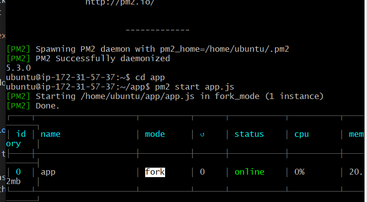

**you may need to add ~/.ssh/**

7. Now we use the following list of commands to install:

```
$ sudo apt update

$ sudo apt upgrade -y

$ curl -sL https://deb.nodesource.com/setup_12.x | sudo -E bash -

$ sudo apt install nodejs -y

$ sudo npm install pm2 -g

```

8. 'cd' into app

9. type 'npm install' or 'sudo apt install npm'

10. type 'node app.js' or 'pm2 start app.js' (to run it in the background)


## Running app and sg

To be able to view the sparta app page, we now need to add a new rule to sg on EC2 to allow traffic through the port. 

1. Go to your EC2 instance page, scroll down, and select 'security'. Edit this to add a new inboud rule:
- The 'type' should be 'custom TCP'
- The port should be 3000
- 0.0.0.0 (for source)

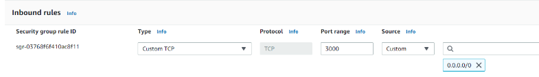

10. Now if you copy the instance IP, paste it into a web browser, and add :3000, you should see the sparta app. 


### Linking the two EC2 instances 

We will link both our nginx instances to see the sparta posts page 

1. Once you have both running instances running, run the following commands in your mongo bash terminal:

```
 $ cd /etc
 $ sudo nano mongodb.conf
 ```

 2. In the nano terminal that pops up, change the bind ip to 0.0.0.0

 
 3. We then need to restart and enable mongodb:

 ```
 $ sudo systemctl restart mongodb
 & sudo systemctl enable mongodb
 ```

 4. Go back to your EC2 instance for mongodb and add a rule to sg so that you have custom TCP '27017' and '0.0.0.0' (for source) (add image)

 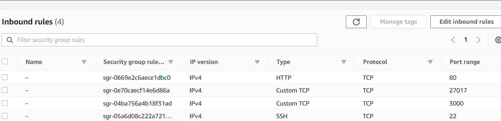


 In app bash terminal

 1. 'ls' check that app is there

 2. node -- version to check for version 12 

 3. Type:

 ```
 export DB_HOST=mongodb://(add private id from mongo ec2 instance summary page)/posts

 e.g., export DB_HOST=mongodb://172.31.63.89/posts

 ```

 4. printenv

 5. cd app

 6. npm install (sometimes, you may have to do node seed/seed.js)

7. pm2 start app .js --update-env

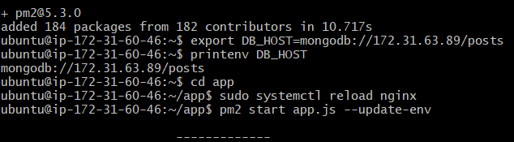


To check that posts page works, copy and paste the public IPv4 adress from your nginx EC2, paste it into browser with/ posts at the end 

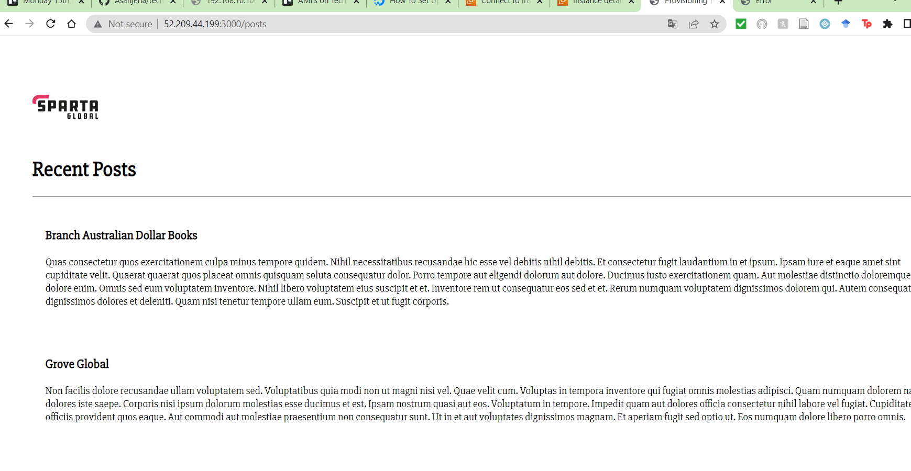


### Creating Images for both these EC2 instances

1. select your running instance > actions > images and templates > create an image

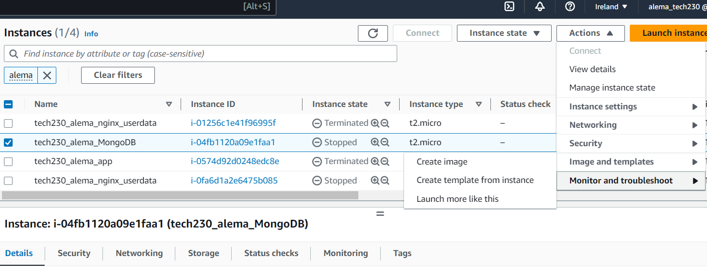

2. Then add a name and a description for your image. You can also add tags if you would like.

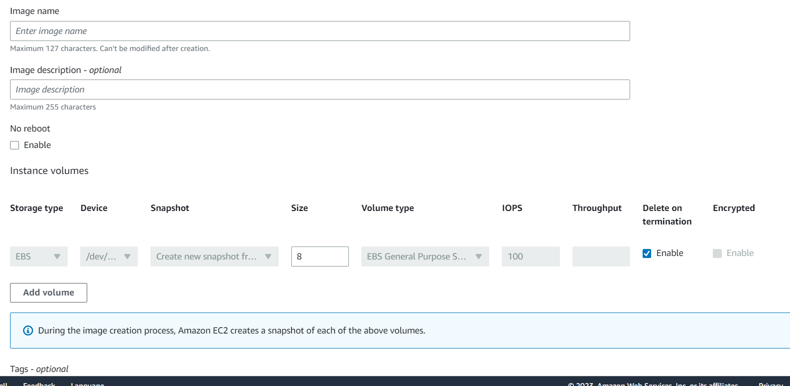

3. Once you hav edone this, click the create button

Follow these steps for both the MongoDB and Nginx EC2 instances 


### Task 1a

1. Create a script file in your app bash terminal:

```
touch app-provision.sh
```

2. To edit the file and add to our scipt, we will use:

```
nano app-provision.sh

```


### Adding a reverse proxy script

In the nano terminal:

#!bin/bash

sudo sed -s "s/try_files \$uri \$uri\/ =404;/ proxy_pass http:\/\/localhost:3000\/;

or
```
sudo sed -i 's/^                try_files $uri $uri\/ =404;/            proxy_pass http:\/\/localhost:3000\/;/g' /etc/nginx/sites-available/default

sudo systemctl restart nginx

```
chmod +x app-provision.sh (to give permission to execute)

./app-provision.sh (to run)

sudo nano /etc/nginx/sites-available/default (to check that the changes have been made)


### 1b 
To start the app in the background type the command:

```
pm2 start app.js --update-env

```

**note** - if app was running before this, use 'pm2 stop app.js'


### 1c

1. Cd to where you would like to create your new app repo
2. Use git init 
3. On github, create a new repo called 'app'
4. git remote add origin http://github.com/Asanjena/app.git
5. git add .
6. Git commit
7. git push origin main

In your vm, you would the git clone http://github.com/Asanjena/app.git


### 1d app user data


#!/bin/bash


sudo apt-get update -y  

 
sudo apt-get upgrade -y


sudo apt-get install nginx -y


sudo sed -i "s/try_files \$uri \$uri\/ =404;/proxy_pass http:\/\/localhost:3000\/;/" /etc/nginx/sites-available/default


sudo sed -i "s/# pass PHP scripts to FastCGI server/location \/posts {\n\t\tproxy_pass http:\/\/localhost:3000\/posts;\n\t}/" /etc/nginx/sites-available/default


sudo systemctl restart nginx

 
sudo systemctl enable nginx

curl -sL https://deb.nodesource.com/setup_12.x | sudo -E bash -

 
sudo apt-get install nodejs -y


sudo npm install pm2 -g

export DB_HOST=mongodb://192.168.10.150:27017/posts


source ~/.bashrc


git clone https://github.com/Asanjena/app.git /home/ubuntu/repo


cd /home/ubuntu/repo/app  

node seeds/seed.js 

pm2 start app.js --update-env

pm2 restart app.js --update-env


### 1d and 1e

Make sue you have ssh'ed into the db vm and then the app vm 

To get the DB_HOST env variable and bind IP set up, in bash script:

sudo sed -i 's/bindIp: 127.0.0.1/bindIp: 0.0.0.0/g' /etc/mongod.conf

DB user data 

#!/bin/bash

 

sudo apt-get update -y
sudo apt-get upgrade -y

 

sudo apt-key adv --keyserver hkp://keyserver.ubuntu.com:80 --recv D68FA50FEA312927

 

echo "deb https://repo.mongodb.org/apt/ubuntu xenial/mongodb-org/3.2 multiverse" | sudo tee /etc/apt/sources.list.d/mongodb-org-3.2.list

 

sudo apt-get update -y
sudo apt-get upgrade -y

 

sudo apt-get install -y mongodb-org=3.2.20 mongodb-org-server=3.2.20 mongodb-org-shell=3.2.20 mongodb-org-mongos=3.2.20 mongodb-org-tools=3.2.20

 

sudo sed -i 's/bindIp: 127.0.0.1/bindIp: 0.0.0.0/g' /etc/mongod.conf

 

sudo systemctl restart mongod
sudo systemctl enable mongod


