## Cloudwatch 

cloudwatch is a service that lets you use 'alarms'.

why is it good to monitor - good to work out when something needs to happen 
tells you cpu usage, ram etc., 

If cpu usage increases to a certain point, you computer stats freezing/ heats up. It starts to cope with it/ cools down by e.g. shutting down somethings or fan might spin up more. = monitoring can help to alert the system when something needs to happen. Depening on what metric you are monitoring, you want a alarm. 

E.g. if you were moitoring cpu utilisation on vm using cw, when it gets to a certain point, you want an alarm to trigger e.g. so that it linkes to autoscalling - you can know when you need more instances. if you dont have it, and cpu goes to 100%, the instances will be overloaded and may fail. To avoid this, you have to work out what the point is when you need an alarm to trigger more instances. 

This is also the case when the average cpu utilization drops bellow a certain point. 

another benfit of cw is that there are available statistics - dashboard - can use this to help your cpu utilisation threshold so that you get an alarm sent to you when it gets to this threshold 

## How to set up a dashboard

1. On your cloudwatch console screen, scroll down and select 'monitoring'. On the lower right hand side, you sould the see the option to 'add to dashboard'. Click on this.

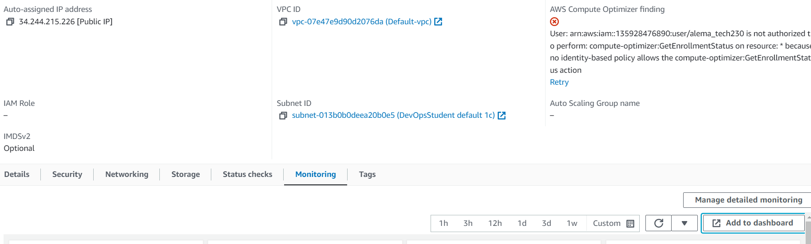

2. Click on 'create new dashboard' and give your dashboard a name.
3. Click 'add to dashboard'

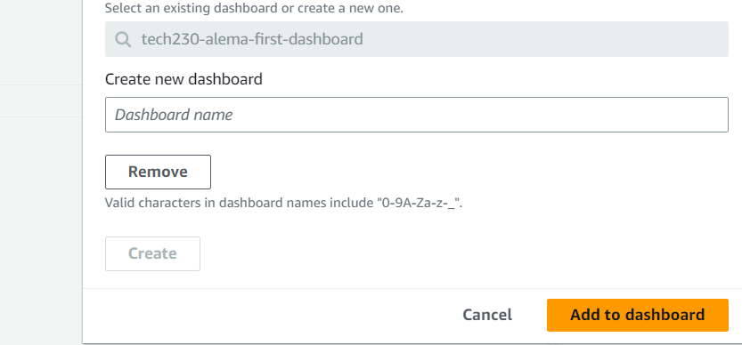

## Creating cpu usage alarm for your EC2 instance with notification email 

1. On the sidebar menu, navigate alarms > all alarms

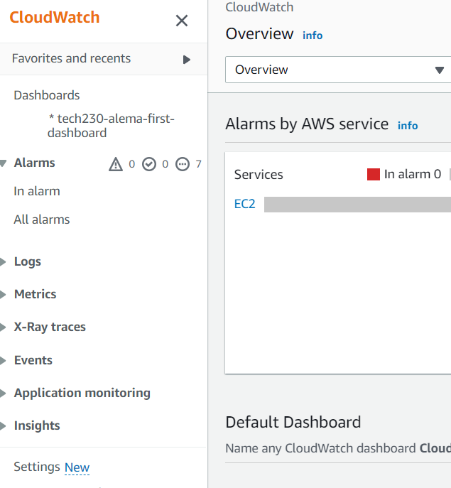

2. Create an alarm 

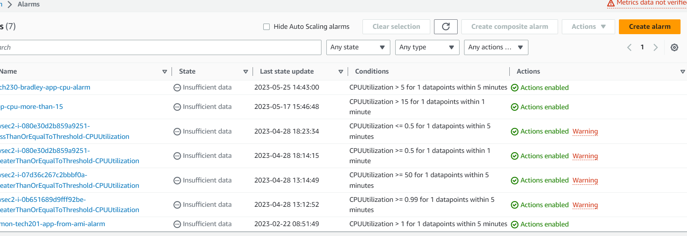

3. select metric > ect . per instance metric

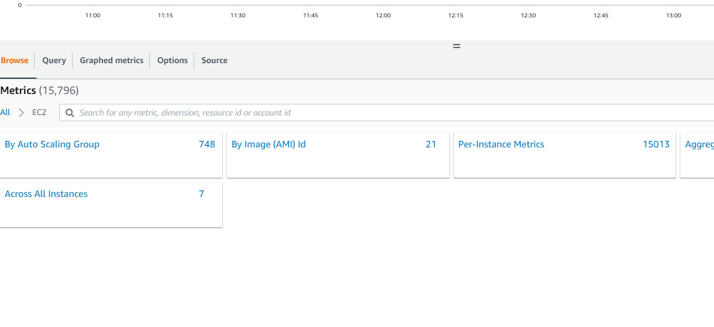

4. Copy and paste you EC2 instance ID into the search bar. Then select the id that has CPUUtilsation nect to it.

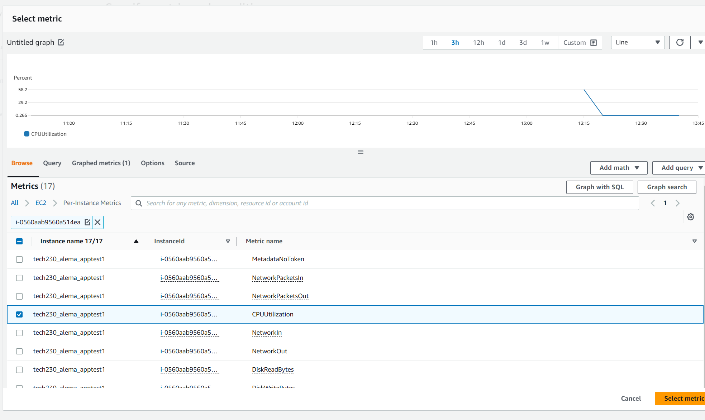

5. For the next step, make sure that you have 'average' selected for statistics.

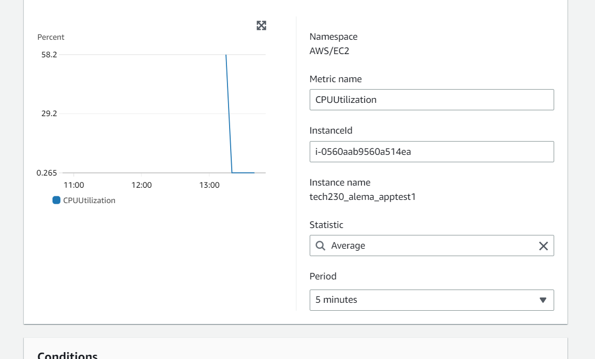

6. Select the threshold type to 'static' and 'greater/ equal to for 'whenever CPUUtilization is...'

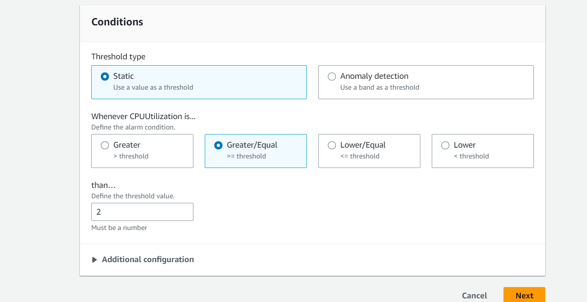

7. Make sure that you select the 'in alarm' option. As you can see below, you also want to choose 'select an existing SNS topic' and send a notification to 'CPU-usage'. 

8. You should also input the email that you would like your notifications to go to:

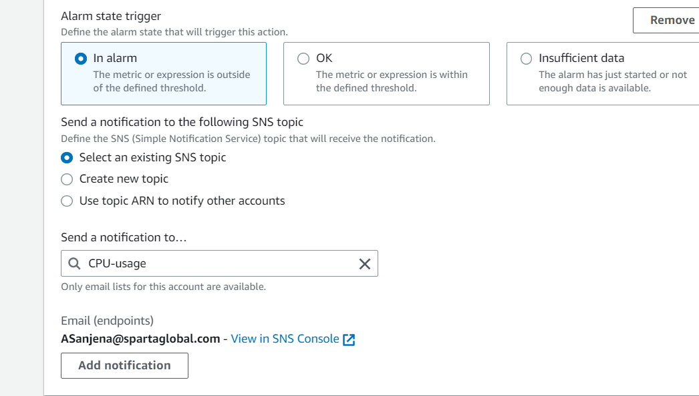  > next 

9. Finally, you can give your alarm a name, including a description. 

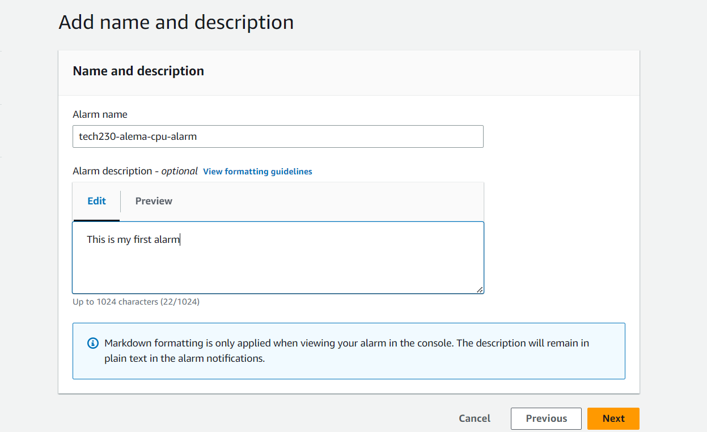

preview page appears - check and click create alarm. 

**note** If you received an email asking you to subscribe to the topic, you can click on 'confirm subscription'

When your alarm goes off, you should receive an email like this:

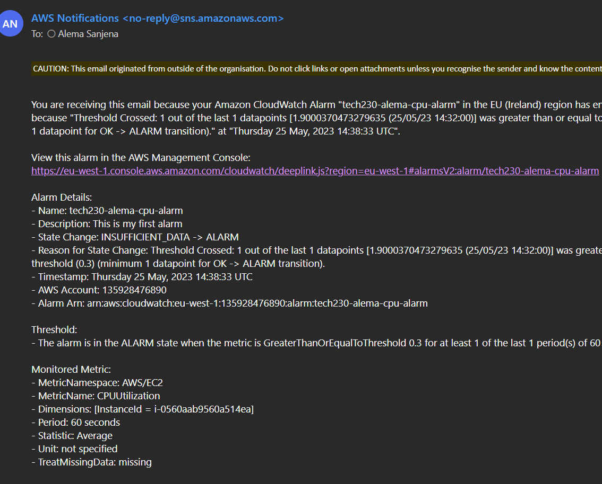